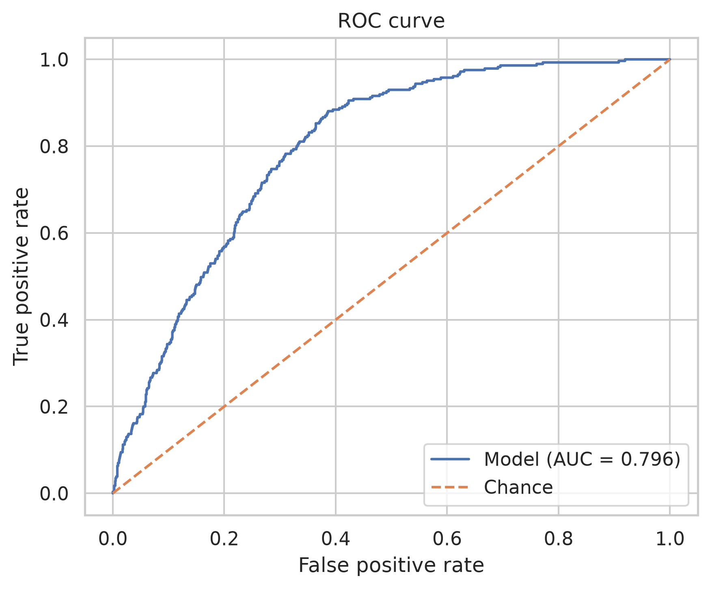
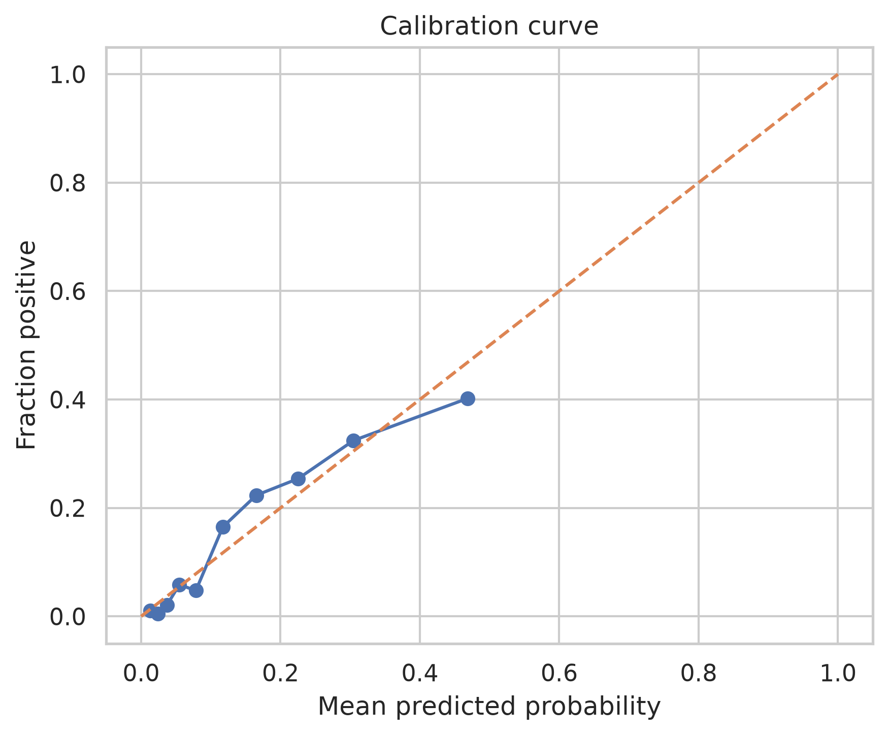
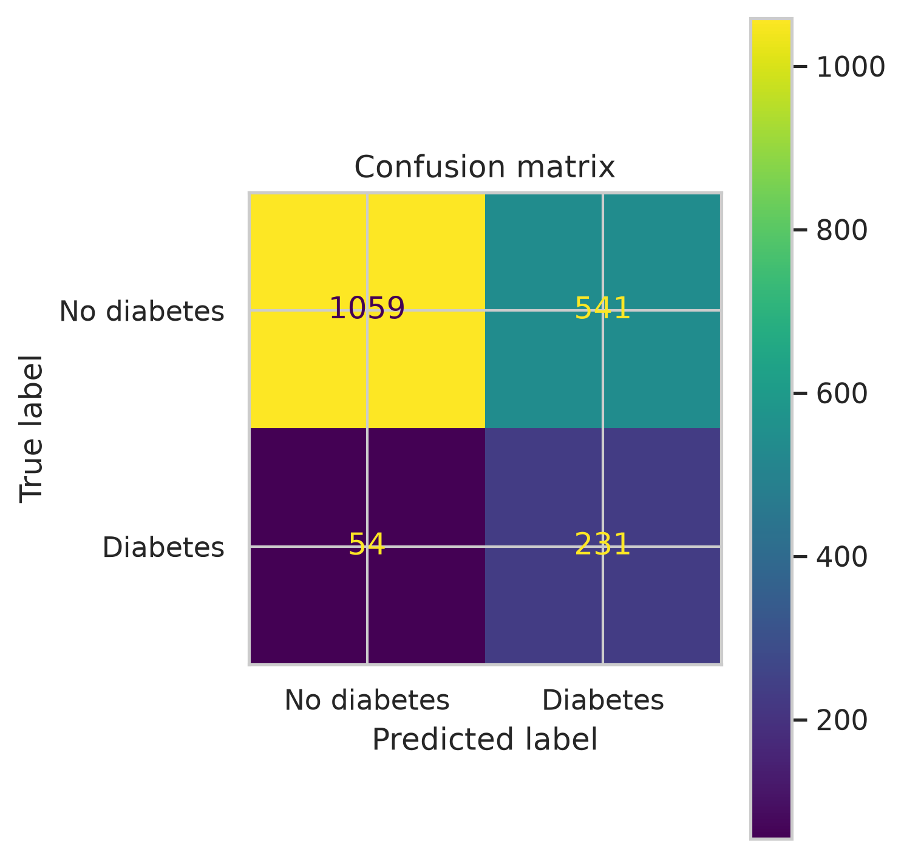
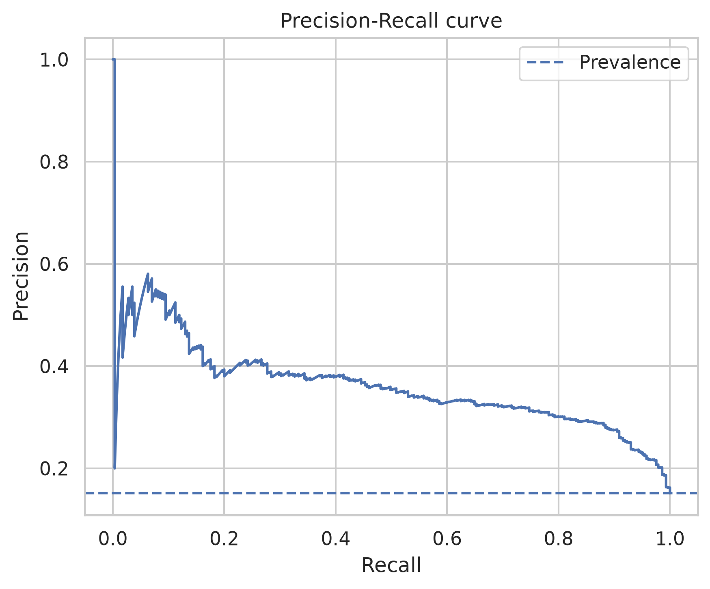

# Clinical risk modelling with NHANES

[](https://github.com/HenryOn2021/clinical-risk-modelling-nhanes/actions/workflows/ci.yml)
[](https://www.python.org/)
[](#verification-and-tests)

An end-to-end, reproducible clinical data-science project that uses the
**NHANES 2017-March 2020 pre-pandemic public-use release** to classify whether
an adult participant reported a clinician diagnosis of diabetes.

The repository covers public-data ingestion, schema validation, cohort
construction, survey-weighted descriptive analysis, an interpretable
statistical baseline, leakage-safe machine learning, probability calibration,
operating-threshold selection, held-out evaluation, bootstrap confidence
intervals, subgroup checks and a model card.

> [!IMPORTANT]
> This is a cross-sectional **classification and screening demonstration**. It
> does not predict future diabetes, establish a diagnosis or support clinical
> decisions.

## Headline result

On a stratified held-out test set of **1,885 adults**, the calibrated logistic
regression achieved:

| Metric | Estimate | 95% bootstrap CI |
|---|---:|---:|
| ROC AUC | **0.796** | 0.773-0.819 |
| Average precision | **0.363** | 0.317-0.422 |
| Sensitivity | **0.811** | 0.766-0.855 |
| Specificity | **0.662** | 0.638-0.684 |
| Negative predictive value | **0.951** | 0.939-0.964 |
| Accuracy | **0.684** | 0.663-0.706 |
| Brier score | **0.111** | 0.102-0.120 |

The operating threshold (**0.1357**) was selected using out-of-fold training
probabilities to meet a prespecified sensitivity target of at least 0.80 while
maximising specificity. The test set was not used to select the threshold.





## Why this project exists

Clinical modelling examples often omit the work that determines whether a
result is trustworthy: defining the outcome, validating source files,
controlling leakage, choosing an operating point, checking calibration,
quantifying uncertainty and documenting limitations.

This project makes those decisions explicit. Its goals are to:

1. demonstrate a transparent pipeline for real public clinical data;
2. separate population description from individual-level prediction;
3. preserve an untouched test set for final evaluation;
4. optimise a clinically interpretable operating target rather than assume a
   probability threshold of 0.5;
5. publish enough artifacts for another analyst to review or reproduce the
   result.

## Problem definition

### Outcome

The binary target is derived from NHANES questionnaire variable `DIQ010`:

- `1` ("Yes") -> diabetes-positive;
- `2` ("No") -> diabetes-negative;
- borderline, refused, unknown and missing responses -> excluded from the
  modelling cohort.

The target therefore represents **self-reported diagnosed diabetes**. People
with undiagnosed diabetes may appear in the negative class, so this is not a
laboratory-confirmed disease label.

### Intended modelling question

> Using routinely collected demographic and examination variables, how well
> can an interpretable model distinguish adults who report diagnosed diabetes
> from those who do not?

This wording matters. Because the data are cross-sectional, the model estimates
contemporaneous classification probability; it is not a longitudinal risk
calculator.

## Data

Data are downloaded directly from the US Centers for Disease Control and
Prevention (CDC) NHANES public-use XPT files.

| Component | File | Role |
|---|---|---|
| Demographics | `P_DEMO.xpt` | Age, sex, race/ethnicity, education, poverty-income ratio and survey weight |
| Diabetes questionnaire | `P_DIQ.xpt` | Self-reported diabetes outcome |
| Body measures | `P_BMX.xpt` | Body mass index |
| Blood pressure | `P_BPXO.xpt` | Repeated systolic and diastolic readings |
| Fasting glucose | `P_GLU.xpt` | Optional target-adjacent laboratory feature; excluded by default |

Source release:
[NHANES 2017-March 2020 pre-pandemic data](https://wwwn.cdc.gov/Nchs/Data/Nhanes/Public/2017/DataFiles/).

### Cohort construction

| Stage | Participants |
|---|---:|
| Demographics source file | 15,560 |
| Adults after table linkage and age restriction | 9,693 |
| Adults with a usable diabetes target | **9,421** |
| Diabetes-positive | 1,423 |
| Diabetes-negative | 7,998 |
| Training set | 7,536 |
| Held-out test set | 1,885 |

The final cohort's unweighted diabetes prevalence was **15.1%**. The
NHANES-examination-weighted descriptive prevalence was **11.6%**.

## Methods

### 1. Ingestion and validation

The ingestion layer:

- downloads only the required CDC XPT files by default;
- writes downloads atomically so a failed transfer does not leave a
  misleading partial file;
- reuses non-empty local files unless `--overwrite` is requested;
- normalises column names and decodes byte-valued object columns;
- validates required variables, person-level key uniqueness and plausible
  numeric ranges before merging.

All tables are linked one-to-one using participant identifier `SEQN`.

### 2. Cleaning and feature engineering

The pipeline:

- standardises NHANES questionnaire missing-value codes;
- averages up to three available systolic and diastolic measurements;
- replaces clinically implausible BMI, glucose and blood-pressure values with
  missing values;
- restricts the cohort to adults aged 18 years or older;
- derives readable age, BMI, sex, race/ethnicity and education categories for
  reporting.

The default model avoids using both continuous variables and their derived
categories. Age and BMI enter the model as continuous features; `age_group`
and `bmi_category` are retained for EDA and subgroup evaluation.

### 3. Descriptive analysis

Descriptive summaries use the NHANES examination weight `WTMECPRP` where
available. They report both weighted and unweighted quantities so the
distinction remains visible.

The code does not claim full design-based variance estimation: strata and PSU
variables are not used to calculate survey-standard errors or confidence
intervals.

### 4. Interpretable statistical baseline

A `statsmodels` logistic regression provides odds ratios for:

- age;
- sex;
- BMI;
- mean systolic blood pressure;
- race/ethnicity;
- education.

The baseline uses complete cases (**7,353 participants; 78.0%** of the
analysis cohort) and HC3 heteroskedasticity-robust standard errors. It is an
association model for interpretability, not a causal analysis and not a full
complex-survey model.

Selected associations from this baseline:

| Predictor | Odds ratio | 95% CI |
|---|---:|---:|
| Age, per year | 1.066 | 1.061-1.071 |
| BMI, per kg/m² | 1.080 | 1.070-1.090 |
| Male vs female | 1.509 | 1.312-1.735 |

### 5. Predictive model

The default model uses:

**Numeric features**

- age;
- BMI;
- mean systolic blood pressure;
- mean diastolic blood pressure;
- poverty-income ratio.

**Categorical features**

- sex;
- race/ethnicity;
- education.

Fasting glucose is deliberately excluded from the primary model because it is
closely related to diabetes diagnosis and is only measured in a fasting
subsample. It can be enabled for a clearly labelled sensitivity analysis.

### 6. Leakage-safe preprocessing

All learned preprocessing is inside a scikit-learn pipeline:

- numeric variables: median imputation followed by standardisation;
- categorical variables: most-frequent imputation followed by one-hot
  encoding with safe handling of unseen levels;
- estimator: class-balanced logistic regression.

Imputation statistics, scaling parameters and category encodings are learned
from training folds only.

### 7. Model selection, calibration and thresholding

The modelling sequence is:

1. create a reproducible 80/20 stratified train-test split (`random_state=42`);
2. tune regularisation strength `C` with five-fold stratified cross-validation
   and ROC AUC;
3. calibrate probabilities using sigmoid calibration within stratified
   cross-validation;
4. generate out-of-fold calibrated probabilities for the training set;
5. choose the highest-specificity threshold that achieves sensitivity
   greater than or equal to 0.80 on those out-of-fold predictions;
6. refit the calibrated model using all training observations;
7. evaluate once on the untouched test set.

The best regularisation setting was `C=1.0`; mean cross-validated training ROC
AUC was **0.791 ± 0.012**.

### 8. Evaluation and uncertainty

The held-out evaluation reports:

- ROC AUC and average precision;
- Brier score and a calibration plot;
- sensitivity, specificity, precision, negative predictive value, F1 and
  accuracy at the stored operating threshold;
- the confusion matrix;
- decision-curve net benefit;
- descriptive subgroup metrics by sex, age group and race/ethnicity.

Ninety-five percent confidence intervals are percentile intervals from 1,000
bootstrap resamples of the held-out test set with a fixed random seed.

## Results

### Discrimination and operating-point performance

| Metric | Estimate | 95% bootstrap CI |
|---|---:|---:|
| ROC AUC | 0.796 | 0.773-0.819 |
| Average precision | 0.363 | 0.317-0.422 |
| Brier score | 0.111 | 0.102-0.120 |
| Accuracy | 0.684 | 0.663-0.706 |
| Precision / PPV | 0.299 | 0.268-0.331 |
| Sensitivity / recall | 0.811 | 0.766-0.855 |
| Specificity | 0.662 | 0.638-0.684 |
| F1 score | 0.437 | 0.399-0.474 |
| Negative predictive value | 0.951 | 0.939-0.964 |

The test-set confusion matrix at threshold 0.1357 was:

| | Predicted negative | Predicted positive |
|---|---:|---:|
| Actual negative | 1,059 | 541 |
| Actual positive | 54 | 231 |

In practical terms, the sensitivity-focused threshold identified **231 of 285**
positive test participants and missed **54**. The trade-off was a relatively
large number of false positives, reflected in the 29.9% positive predictive
value.





### Subgroup checks

These are descriptive diagnostics, not evidence that the model is fair or
transportable. No subgroup confidence intervals are applied, and some groups
contain few positive examples.

#### Sex

| Group | N | Positive cases | Sensitivity | False-positive rate | ROC AUC |
|---|---:|---:|---:|---:|---:|
| Female | 981 | 134 | 0.791 | 0.320 | 0.782 |
| Male | 904 | 151 | 0.828 | 0.359 | 0.808 |

#### Age group

| Group | N | Positive cases | Sensitivity | False-positive rate | ROC AUC |
|---|---:|---:|---:|---:|---:|
| 18-39 | 669 | 11 | 0.182 | 0.012 | 0.733 |
| 40-59 | 578 | 90 | 0.556 | 0.266 | 0.698 |
| 60+ | 638 | 184 | 0.973 | 0.888 | 0.636 |

The single global threshold behaves very differently across age groups. Age is
a strong predictor and diagnosed-diabetes prevalence differs substantially by
age, so the high false-positive rate among older participants is an important
limitation rather than a result to conceal. Any real application would require
prospective utility analysis, subgroup uncertainty estimates, external
validation and reconsideration of threshold policy.

Full sex, age and race/ethnicity tables are available in the
[model card](docs/model_card.md).

## Repository structure

```text
.
├── .github/workflows/ci.yml       # Lint, compile and test workflow
├── artifacts/
│   ├── baseline/                  # Baseline summaries and odds ratios
│   ├── metrics/                   # CV, test, CI, EDA and subgroup results
│   └── models/                    # Local serialized model; ignored by Git
├── data/
│   ├── raw/                       # Downloaded XPT files; ignored by Git
│   ├── interim/                   # Linked/cleaned data; ignored by Git
│   └── processed/                 # Analysis data and predictions; ignored by Git
├── docs/
│   ├── methodology.md             # Detailed methodological decisions
│   ├── model_card.md              # Intended use, results and limitations
│   └── results_summary.md         # Generated compact result summary
├── notebooks/                     # Guided, paired Jupyter/Jupytext walkthroughs
├── reports/figures/               # Versioned portfolio figures
├── scripts/                       # Ordered command-line workflow
├── src/nhanes_showcase/           # Reusable package modules
├── tests/                          # Unit, script and notebook-integrity tests
└── uv.lock                         # Cross-platform dependency lock file
```

## Script-by-script workflow

| Script | Purpose | Main outputs |
|---|---|---|
| `run_ingest.py` | Download CDC XPT files | `data/raw/*.xpt` |
| `build_dataset.py` | Validate, link, clean and build cohort | Parquet datasets and QC JSON |
| `run_eda.py` | Weighted/unweighted summaries and EDA | CSV summaries and figures |
| `run_baseline.py` | Fit interpretable complete-case baseline | Odds ratios, summary and plot |
| `run_ml.py` | Tune, calibrate, threshold and save predictions | Model, CV results and test predictions |
| `run_evaluation.py` | Evaluate held-out predictions | Metrics, bootstrap CIs, subgroup tables and plots |
| `export_assets.py` | Build viewer-facing documentation | Model card and results summary |

## Reproduce the analysis

### 1. Create an environment

The recommended setup uses
[uv](https://docs.astral.sh/uv/), which creates `.venv` automatically and
installs the versions recorded in `uv.lock`:

```bash
git clone https://github.com/HenryOn2021/clinical-risk-modelling-nhanes.git
cd clinical-risk-modelling-nhanes
uv sync --extra dev
```

Run commands inside the environment with `uv run`, for example
`uv run pytest -q`. Activating `.venv` is optional.

Manual `venv` setup remains supported:

```bash
git clone https://github.com/HenryOn2021/clinical-risk-modelling-nhanes.git
cd clinical-risk-modelling-nhanes

python -m venv .venv
source .venv/bin/activate
python -m pip install --upgrade pip
pip install -e ".[dev]"
```

On Windows PowerShell, activate the environment with:

```powershell
.venv\Scripts\Activate.ps1
```

> [!NOTE]
> `.venv` is created locally but intentionally excluded from Git and the
> portable repository archive. It contains operating-system-specific binaries
> and absolute paths, so a Linux-generated environment would not work on
> Windows and vice versa. `pyproject.toml` plus `uv.lock` are the portable,
> reproducible representation of the environment.

### 2. Run the default analysis

```bash
python scripts/run_ingest.py
python scripts/build_dataset.py
python scripts/run_eda.py
python scripts/run_baseline.py
python scripts/run_ml.py --minimum-sensitivity 0.80 --n-jobs 1
python scripts/run_evaluation.py --decision-curve --bootstrap-samples 1000
python scripts/export_assets.py
```

`--n-jobs 1` is intentionally safe for laptops, CI runners and constrained
containers. Increase it only when the execution environment supports
additional worker processes.

### 3. Explore the guided notebooks

```bash
uv run jupyter lab
```

Open the notebooks in numeric order:

1. `00_project_overview.ipynb`
2. `01_data_and_cohort.ipynb`
3. `02_eda_and_baseline.ipynb`
4. `03_modelling_and_evaluation.ipynb`

Each notebook is paired with a Jupytext `py:percent` file for reviewable Git
diffs. The notebooks reuse the tested package and saved artifacts; they do not
contain a second implementation of the pipeline. See
[notebooks/README.md](notebooks/README.md) for details.

### 4. Optional fasting-glucose sensitivity analysis

```bash
python scripts/run_ingest.py --include-glucose
python scripts/build_dataset.py --include-glucose
python scripts/run_ml.py --include-glucose --minimum-sensitivity 0.80 --n-jobs 1
python scripts/run_evaluation.py --decision-curve
```

Do not compare this run with the default model without noting that glucose is
target-adjacent, is collected in a subsample and changes the missing-data and
survey-weight considerations.

## Verification and tests

The corrected repository was verified on **28 July 2026** with Python 3.12:

```bash
python -m compileall -q scripts src tests notebooks
ruff check .
ruff format --check .
pytest -q
```

Expected test result:

```text
30 passed
```

Tests cover target mapping, missing-code handling, clinical plausibility rules,
survey-weight selection, feature construction, data splitting, preprocessing,
threshold selection, metric calculation, bootstrap intervals, subgroup
evaluation, schema failures, weighted summaries and importability of every
command-line script. They also validate the Jupyter/Jupytext pairs and ensure
the distributed notebooks do not contain executed outputs or an enabled
training-overwrite flag.

## Important limitations

1. **Not prospective risk prediction.** NHANES is cross-sectional.
2. **Self-reported outcome.** Undiagnosed disease and recall error create label
   noise.
3. **No external validation.** Performance is from one reproducible internal
   test split.
4. **Survey design.** Survey weights support descriptive estimates, but the
   model and bootstrap analysis do not implement full NHANES design-based
   inference.
5. **Threshold transportability.** A threshold selected in this sample may not
   transfer to another prevalence, setting or clinical workflow.
6. **Subgroup uncertainty.** Group metrics are descriptive and some positive
   counts are small.
7. **Sensitive variables.** Sex and race/ethnicity are survey categories, not
   causal biological explanations.
8. **Complete-case baseline.** Baseline odds ratios use 78.0% of the analysis
   cohort and may be affected by selection from missingness.
9. **Model scope.** Logistic regression is deliberately interpretable; this
   project does not establish that it is the best possible algorithm.

## Reproducibility artifacts

- [Detailed methodology](docs/methodology.md)
- [Model card](docs/model_card.md)
- [Generated results summary](docs/results_summary.md)
- [Test metrics](artifacts/metrics/test_metrics.json)
- [Bootstrap intervals](artifacts/metrics/test_metric_intervals.csv)
- [Training and threshold record](artifacts/metrics/training_summary.json)
- [Code-audit notes](docs/debug_audit.md)
- [Guided notebooks](notebooks/README.md)

## Responsible use

Do not use the model for diagnosis, treatment, insurance, employment,
eligibility or individual risk communication. Before any applied use, the work
would require a clinically specified target population and decision, external
and prospective validation, comparison with existing care pathways, subgroup
uncertainty analysis, data-governance review and ongoing monitoring.

## Citation

If you reuse this project, cite the repository and the CDC/NCHS NHANES
2017-March 2020 pre-pandemic release. NHANES variable definitions and analytic
guidance remain authoritative over interpretations in this demonstration.

## Author

**Henry On**  
Clinical data scientist and machine-learning researcher
